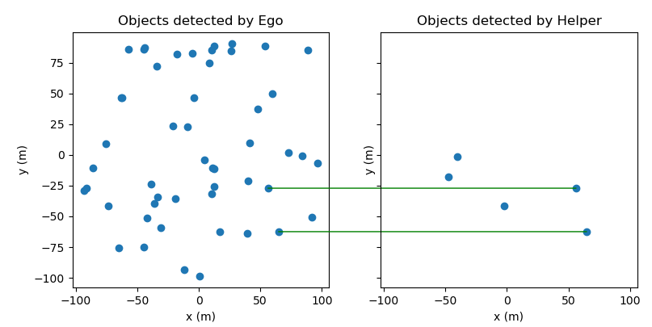

# A Spatial Calibration Method for Robust Cooperative Perception
This is the python implementation of Algorithm 1 in the paper:

[A Spatial Calibration Method for Robust Cooperative Perception (arxiv)](https://arxiv.org/abs/2304.12033)

Zhiying Song, Tenghui Xie, Hailiang Zhang, Fuxi Wen, and Jun Li


## Introduction

We study the problem of inter-agent object association along with inter-agent relative pose estimation to calibrate spatial errors for object-level cooperative perception. 


## Demo

Execute the demo as

```python
python main.py
```

Both ```numpy``` and ```torch```  implementations of $\tt{CBM}$ are available.

A demo result:



Tested on:

- Ubuntu 18.04
- Torch 1.9.1

