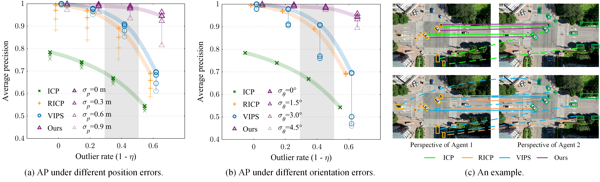
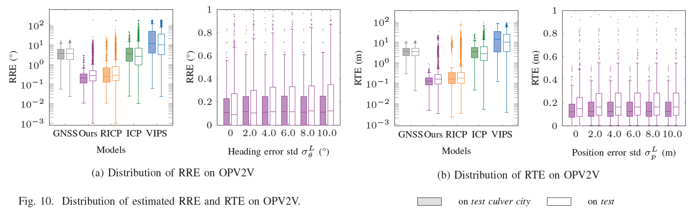
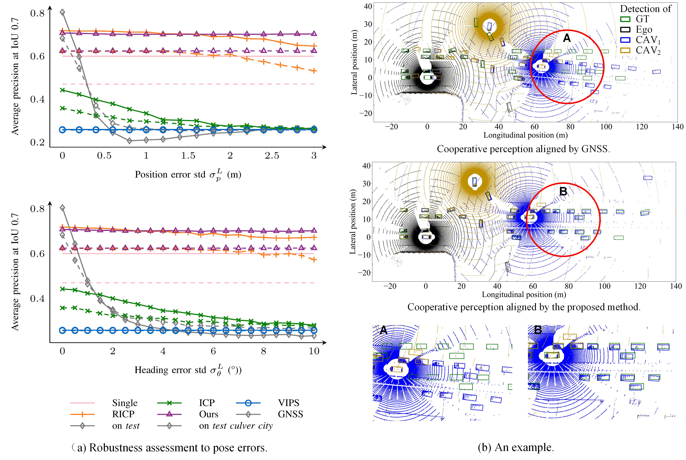

# A Spatial Calibration Method for Robust Cooperative Perception
This is the python implementation of $\tt{CBM}$ in the paper:

[A Spatial Calibration Method for Robust Cooperative Perception (arxiv)](https://arxiv.org/abs/2304.12033)

Zhiying Song, Tenghui Xie, Hailiang Zhang, Fuxi Wen, and Jun Li


## Introduction

Cooperative perception (CP) is a promising technique for enhancing the perception capabilities of automated vehicles through vehicle-to-everything (V2X) cooperation, provided that accurate relative pose transforms are available. Nevertheless, obtaining precise positioning information often entails high costs associated with navigation systems. Moreover, signal drift resulting from factors such as occlusion and multipath effects can compromise the stability of the positioning information. Hence, a low-cost and robust method is required to calibrate relative pose information for multi-agent cooperative perception. In this paper, we propose a simple but effective inter-agent object association approach (CBM), which constructs contexts using the detected bounding boxes, followed by local context matching and global consensus maximization. Based on the matched correspondences, optimal relative pose transform is estimated, followed by cooperative perception fusion. 


## How do localization errors impact CP?

To demonstrate the impact of localization errors on cooperative perception, we have selected certain scenarios from [OPV2V](https://arxiv.org/pdf/2109.07644.pdf) Test Culver City and created the [video](without_CBM.mp4). It is assumed that Cav (Connected Autonomous Vehicle) and Ego (the host vehicle) perform 3D object detection independently. Cav then sends its results to Ego and transforms them into Ego's coordinate system. Random Gaussian errors are applied to Cav's position (x, y) and heading angle.

Indeed, the localization errors cause the bounding boxes received by Ego to randomly jump in space, leading to significant disruptions in its own perception system. In this scenario, Ego not only fails to benefit from collaborative perception but is instead disturbed by the errors.

<video src="figure/without_CBM.mp4"></video>


## How to calibrate the localization errors?

Details of  $\tt{CBM}$ method are shown in the [paper](https://arxiv.org/abs/2304.12033).


## How well the localization errors are calibrated?

### Matching performance

Because $\tt{CBM}$ calibrates localization errors mainly by matching boxes from different agents, firstly we test its matching performance on the drone dataset [SIND](https://arxiv.org/ftp/arxiv/papers/2209/2209.02297.pdf).




### Localization Calibration Performance

[The video](with_CBM.mp4) demonstrates the performance of $\tt{CBM}$ on the entire OPV2V Test Culver City dataset (a total of 549 frames). As it is observed, the perception results of Cav (depicted by blue bounding boxes) and Ego (represented by black bounding boxes) are no longer randomly jumping but instead aligning properly. After calibration, the errors are consistently maintained at lower levels (Relative Rotation Error and Relative Translation Error). For more detailed test results, please refer to the [paper](https://arxiv.org/abs/2304.12033).

<video src="figure/with_CBM.mp4"></video>





### Cooperative Perception Performance




## How to run the code?

This repository provides the implementation of $\tt{CBM}$, i.e., the Algorithm 1 in the [paper](https://arxiv.org/abs/2304.12033), it takes two sets of bounding boxes as input and outputs the pairwise relationships between them, which can be further used to calculate the relative pose transformation between the cooperative agents by simple SVD.

Both ```numpy``` and ```torch```  implementations of $\tt{CBM}$  are available. And it's quite simple to implement it yourself by executing the demo as ```python main.py```.

Certainly, you can incorporate CBM as a module into your collaborative perception system by calling the CBM class in CBM_torch.py. This allows you to utilize the functionalities of CBM within your existing system without the need to reimplement the algorithm. 


